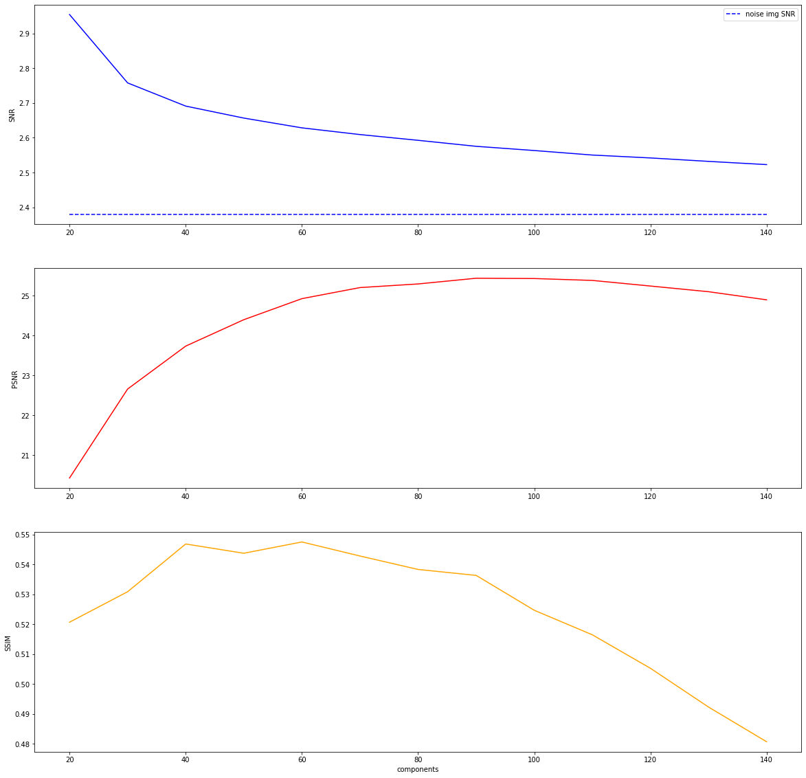
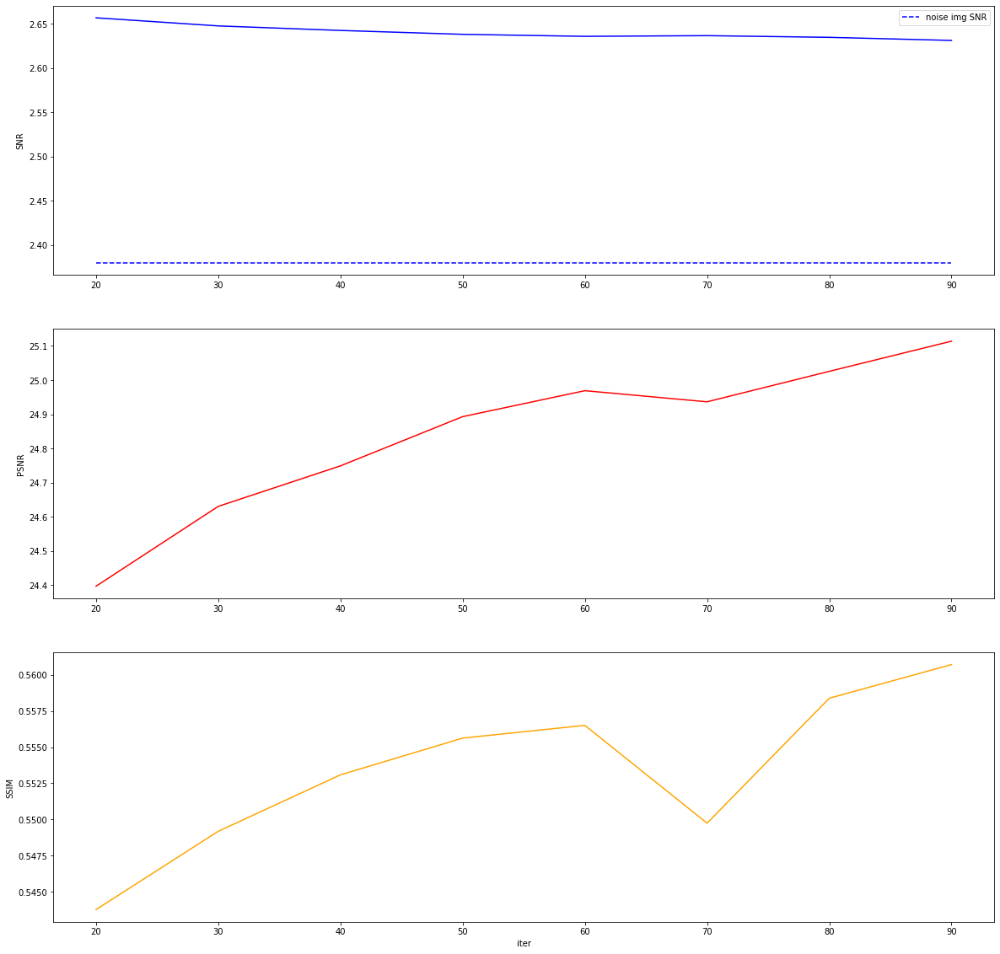
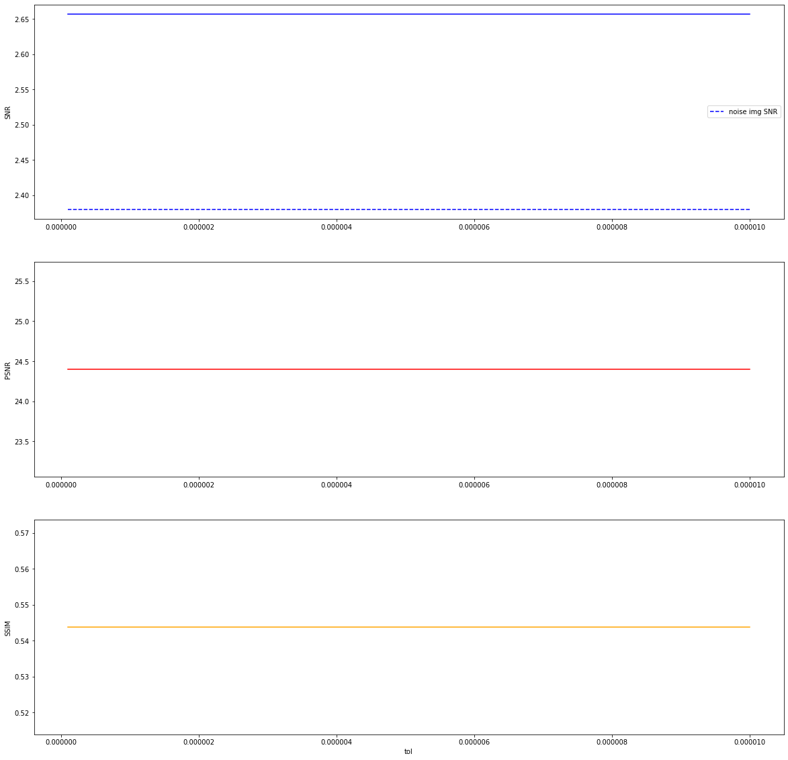

## ksvd 各种参数去噪效果分析
> - 实验背景：在同一β=20 占比为1.0的高斯噪声环境来进行测试
> - 备注：SSIM与PSNR都是和无噪声图像的对比，数值越高，还原程度越好

### 1.载入数据


```python
import pandas

# 读取实验结果文件
df=pandas.read_csv("/data/jupyter/root/denoise/DCT_params_test_gauss.csv")
print(df)
```

         components  iter           tol  noise SNR       SNR       PSNR      SSIM
    0            20    20  1.000000e-05       2.38  2.954090  20.427903  0.520678
    1            20    20  1.000000e-06       2.38  2.954090  20.427903  0.520678
    2            20    20  1.000000e-07       2.38  2.954090  20.427903  0.520678
    3            20    30  1.000000e-05       2.38  2.954126  20.427965  0.520718
    4            20    30  1.000000e-06       2.38  2.954126  20.427965  0.520718
    ..          ...   ...           ...        ...       ...        ...       ...
    307         140    80  1.000000e-06       2.38  2.516934  24.919386  0.481510
    308         140    80  1.000000e-07       2.38  2.516934  24.919386  0.481510
    309         140    90  1.000000e-05       2.38  2.516645  24.926329  0.481831
    310         140    90  1.000000e-06       2.38  2.516645  24.926329  0.481831
    311         140    90  1.000000e-07       2.38  2.516645  24.926329  0.481831
    
    [312 rows x 7 columns]


### 2. 分析数据关系
#### 2.1 去噪效果与字典原子个数的关系 （迭代数=20，容忍度=1.0e-5)


```python
# 筛选数据
components_df=df[(df['iter']==20) & (df['tol']==1e-5)]
print(components_df
```

         components  iter      tol  noise SNR       SNR       PSNR      SSIM
    0            20    20  0.00001       2.38  2.954090  20.427903  0.520678
    24           30    20  0.00001       2.38  2.757616  22.659166  0.530885
    48           40    20  0.00001       2.38  2.690972  23.735167  0.546868
    72           50    20  0.00001       2.38  2.656553  24.397055  0.543768
    96           60    20  0.00001       2.38  2.628449  24.924578  0.547543
    120          70    20  0.00001       2.38  2.609175  25.202378  0.542844
    144          80    20  0.00001       2.38  2.592633  25.293401  0.538349
    168          90    20  0.00001       2.38  2.575390  25.436181  0.536350
    192         100    20  0.00001       2.38  2.563299  25.428865  0.524679
    216         110    20  0.00001       2.38  2.550319  25.381604  0.516462
    240         120    20  0.00001       2.38  2.541987  25.240928  0.505253
    264         130    20  0.00001       2.38  2.532111  25.098849  0.492275
    288         140    20  0.00001       2.38  2.522847  24.895069  0.480660


```python
import matplotlib.pyplot as plt
plt.figure(figsize=(20,20))
plt.subplot(311)
plt.plot(components_df['components'],components_df['SNR'],color="blue")
plt.plot(components_df['components'],components_df['noise SNR'],linestyle='--',color="blue",label='noise img SNR')
plt.legend(loc='best')
plt.ylabel("SNR")
plt.subplot(312)
plt.plot(components_df['components'],components_df['PSNR'],color="red")
plt.ylabel("PSNR")
plt.subplot(313)
plt.plot(components_df['components'],components_df['SSIM'],color="orange")
plt.ylabel("SSIM")
plt.xlabel("components")
plt.show()
```





##### 2.2 去噪效果与字典迭代次数的关系 （字典原子数=50，容忍度=1.0e-5）


```python
iter_df=df[(df['components']==50) & (df['tol']==1e-5)]
print(iter_df)
```

        components  iter      tol  noise SNR       SNR       PSNR      SSIM
    72          50    20  0.00001       2.38  2.656553  24.397055  0.543768
    75          50    30  0.00001       2.38  2.647409  24.630518  0.549182
    78          50    40  0.00001       2.38  2.642284  24.749043  0.553085
    81          50    50  0.00001       2.38  2.637907  24.892975  0.555627
    84          50    60  0.00001       2.38  2.635635  24.968948  0.556508
    87          50    70  0.00001       2.38  2.636421  24.936450  0.549744
    90          50    80  0.00001       2.38  2.634501  25.025561  0.558387
    93          50    90  0.00001       2.38  2.631037  25.113746  0.560714


```python
plt.figure(figsize=(20,20))
plt.subplot(311)
plt.plot(iter_df['iter'],iter_df['SNR'],color="blue")
plt.plot(iter_df['iter'],iter_df['noise SNR'],linestyle='--',color="blue",label='noise img SNR')
plt.legend(loc='best')
plt.ylabel("SNR")
plt.subplot(312)
plt.plot(iter_df['iter'],iter_df['PSNR'],color="red")
plt.ylabel("PSNR")
plt.subplot(313)
plt.plot(iter_df['iter'],iter_df['SSIM'],color="orange")
plt.ylabel("SSIM")
plt.xlabel("iter")
plt.show()
```





#### 2.3 去噪效果与容忍度的关系(字典原子数=50，迭代数=20）


```python
tol_df=df[(df['components']==50) & (df['iter']==20)]
print(tol_df)
```

        components  iter           tol  noise SNR       SNR       PSNR      SSIM
    72          50    20  1.000000e-05       2.38  2.656553  24.397055  0.543768
    73          50    20  1.000000e-06       2.38  2.656553  24.397055  0.543768
    74          50    20  1.000000e-07       2.38  2.656553  24.397055  0.543768


```python
plt.figure(figsize=(20,20))
plt.subplot(311)
plt.plot(tol_df['tol'],tol_df['SNR'],color="blue")
plt.plot(tol_df['tol'],tol_df['noise SNR'],linestyle='--',color="blue",label='noise img SNR')
plt.legend(loc='best')
plt.ylabel("SNR")
plt.subplot(312)
plt.plot(tol_df['tol'],tol_df['PSNR'],color="red")
plt.ylabel("PSNR")
plt.subplot(313)
plt.plot(tol_df['tol'],tol_df['SSIM'],color="orange")
plt.ylabel("SSIM")
plt.xlabel("tol")
plt.show()
```





### 3. 总结
1. 在字典原子个数的影响实现中，可以看到原子个数过多或者过少，都会导致去噪效果变差。最佳的范围在40-100之间
2. 在迭代次数的影响中，迭代次数越多，去噪效果越好
3. 容忍度对去噪效果影响很小


```python

```
